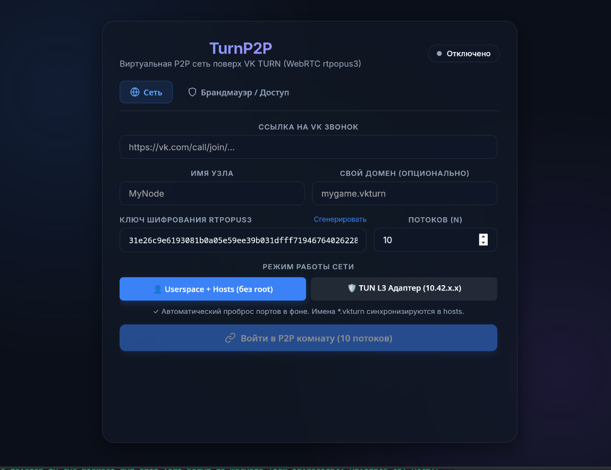

# TurnP2P

Опенсорсная утилита для создания виртуальных локальных сетей (L3 VPN / P2P-оверлей) между компьютерами за NAT (аналог Hamachi, Radmin VPN или ZeroTier).

В качестве бесплатного и устойчивого к сетевым ограничениям транспорта TurnP2P использует общедоступную сеть медиа-релеев (TURN) платформы **ВK Звонки**, маскируя весь трафик под легитимный голосовой поток WebRTC. Не требует белого IP, выделенных серверов или регистрации аккаунтов.

<p align="center">
  
</p>

---

## На чём основан проект и как это работает

Идея проекта — дать пользователям возможность быстро объединять компьютеры в защищённую локальную сеть даже в условиях изоляции интернета, строгих блокировок (белые списки, ТСПУ) и симметричных NAT, когда прямое соединение двух ПК невозможно.

### Технологический стек и компоненты:
* **Бэкенд:** Go 1.22+
* **Графический интерфейс:** Wails v2 (легковесный нативный WebView без раздутого Chromium) + React / TypeScript / Vite
* **TURN / WebRTC транспорт:** [pion/turn](https://github.com/pion/turn)
* **Драйвер виртуального сетевого адаптера:**
  * **Linux:** нативный системный драйвер ядра `/dev/net/tun`
  * **Windows:** официальный драйвер [Wintun](https://www.wintun.net/) (разработанный Джейсоном Доненфельдом для WireGuard)
* **Шифрование:** ChaCha20-Poly1305 (256-битный AEAD)
* **Сигналинг:** распределённые публичные MQTT-брокеры (EMQX, Mosquitto)

---

## Архитектура

### 1. Транспорт через VK TURN
* Подключение привязывается к анонимной гостевой ссылке звонка (`https://vk.com/call/join/...`).
* Авторизация в аккаунт не требуется. Встроенный фоновый headless-обработчик (Chromium/Edge) автоматически проходит PoW-проверку робота в API VK и извлекает временные сессионные токены к пулу серверов `95.163.34.x`.
* Учётные данные кэшируются для исключения лишних запросов к API.

### 2. Маскировка трафика (`rtpopus3`)
Для обхода DPI-фильтрации и систем контроля пакетов трафик мимикрирует под аудиопоток WebRTC:
* Пакеты шифруются общим симметричным ключом комнаты (**ChaCha20-Poly1305**).
* Полезная нагрузка упаковывается в валидные заголовки **RTP (Payload Type 111, Opus Voice)** с динамическими sequence numbers и таймстемпами.
* Добавляются заголовки расширений по стандарту **RFC 8285** (`audio-level` и `transport-cc`), благодаря чему поток неотличим от обычного аудиовызова.

### 3. Мультистриминг (Multi-Stream Bonding)
Трафик внутри туннеля распределяется по пулу из 5–10 параллельных независимых TURN-сессий к разным IP-адресам серверов. Это обходит пропускные лимиты одного медиапотока и повышает устойчивость к потерям пакетов.

### 4. Режимы работы сети
1. **TUN L3 Network Adapter (Рекомендуется):**
   * Создаётся виртуальный интерфейс `turnp2p0` с IP-адресом из подсети `10.42.0.0/16`.
   * MTU установлен в 1380 (TCP MSS 1340), что гарантирует передачу пакетов без дробления и задержек.
   * Все игры и системные утилиты видят сеть как физический LAN-кабель.
   * Требуются права root (Linux) или подтверждение UAC (Windows).
2. **Userspace + Hosts:**
   * Работает без прав администратора.
   * Трафик приложений перехватывается встроенным TCP-прокси на `127.0.0.1`, а локальные домены (`ник.vkturn`) записываются в системный `hosts`.

### 5. Брандмауэр портов (Firewall & Stateful Conntrack)
* **Whitelist (по умолчанию):** входящие соединения разрешены только на порты, явно добавленные в список (например, 25565 для сервера Minecraft).
* **Stateful UDP Conntrack:** исходящие UDP-сессии запоминаются, поэтому ответы от удалённых серверов и голосовых модов (Plasmo Voice, Simple Voice Chat) автоматически пропускаются даже при закрытых портах.
* **Block All / Allow All:** полная изоляция или полное открытие всех входящих портов.

---

## Инструкция по использованию

### Быстрый старт (соединение двух ПК):

1. **Создайте комнату звонка:**
   * Откройте [calls.vk.com](https://calls.vk.com) (или приложение VK на телефоне/ПК).
   * Нажмите **«Создать звонок»** и скопируйте ссылку вида `https://vk.com/call/join/...` (находится в звонке для работы не нужно).
2. **Настройка на первом компьютере (Хост):**
   * Вставьте ссылку в поле **«Ссылка на VK Звонок»**.
   * Задайте свой никнейм.
   * Скопируйте ссылку и **Ключ шифрования** (кнопка копирования рядом с полем ключа).
   * Нажмите **«Войти в P2P комнату»**.
3. **Настройка на втором компьютере (Друг):**
   * Вставьте **ту же самую ссылку на звонок**.
   * Вставьте **тот же самый ключ шифрования** (ключ у всех участников одной сети обязан совпадать!).
   * Нажмите **«Войти в P2P комнату»**.
4. **Проверка связи:**
   * Через несколько секунд статус сменится на «Подключено», а в списке пиров появится ваш друг с его виртуальным IP (`10.42.X.Y`) и доменом (`ник.vkturn`).
   * Можно проверить связь командой в терминале: `ping 10.42.X.Y`.

### Совместная игра (например, Minecraft):
1. Хост открывает игру для сети (Open to LAN) или запускает сервер. В чате игры пишется порт (например, `54321` или `25565`).
2. Хост в TurnP2P во вкладке **«Брандмауэр»** добавляет этот порт в список разрешённых.
3. Друг в меню сетевой игры подключается по адресу: `10.42.X.Y:порт` (где IP хоста берется из списка пиров).

---

## Ограничения и нюансы текущей версии

* **Задержка (пинг):** Трафик маршрутизируется через медиа-релеи VK (в основном серверы расположены в Москве и Санкт-Петербурге). Физический пинг между участниками обычно составляет 30–60 мс.
* **Пропускная способность:** Инфраструктура оптимизирована для голосовых потоков. Скорости с запасом хватает для онлайн-игр, SSH, VNC, RDP и обмена файлами, но многогигабитная передача данных или торренты будут упираться в лимиты медиасерверов.
* **Предупреждение SmartScreen на Windows:** У исполняемого файла пока нет коммерческой цифровой подписи (EV Certificate), поэтому Windows SmartScreen при первом запуске может выдать стандартное предупреждение о неизвестном издателе. Проект полностью открыт, исходный код и Wintun-драйвер можно проверить самостоятельно.

---

## Сборка из исходников

### Требования
* **Go** 1.22+
* **Node.js** 18+ и **npm**
* **Wails CLI v2**:
  ```bash
  go install github.com/wailsapp/wails/v2/cmd/wails@latest
  ```

### Сборка под текущую ОС:
```bash
git clone https://github.com/NullCoreDeveloper/TurnP2P.git
cd TurnP2P/turnp2p
wails build -clean
```
Готовый бинарник появится в директории `build/bin/`.

---

## Лицензия

Проект распространяется под лицензией **GNU General Public License v3.0 (GPL-3.0)**. Подробности см. в файле [LICENSE](LICENSE).
